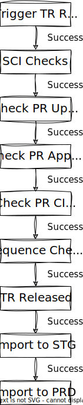

== Deployment

When development is done, unit tested and reviewed, the next step is to deploy the changes to production.
This is done via the classic Change and Transport System (CTS).

=== Deployment Process Overview

something something

=== todo

Auditing via classic CTS

Pre-production environment

Heliconia Labs will provide more tooling in this area in the future

ATC/SCI to check eg. package structure

check branch is approved, up to date + ok status checks

release override feature

badi `CTS_REQUEST_CHECK`, `CHECK_BEFORE_RELEASE`

irreversible changes, eg. DDIC => abaplint.app feature / warning

=== Sequencing

txn `/SDF/TRCHECK`

finding possible sequence issues early => abaplint.app feature

feedback loop, if something fails late in the process, something early in the process should be fixed to catch it

=== Rollback

rollback feature