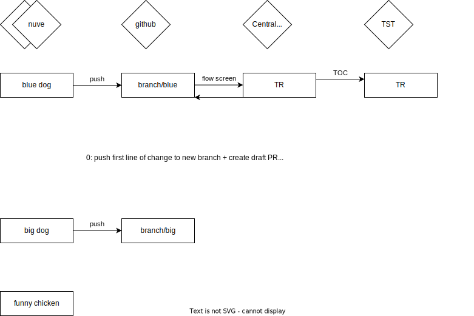
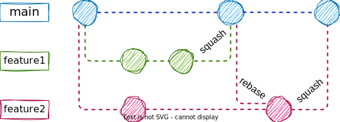
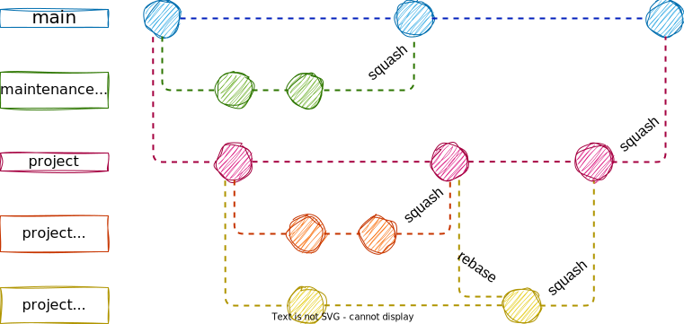

== Development

Development is done centrally in DEV and/or de-centrally in the Nuve systems.

scoping: reduce task size, deploy often

development guidelines impact: packages, message classes, reduce size

examples

Technical Quality assurance & Functional Quality assurance

=== Branching Examples

Avoid long lived branches, but its possible to do:

